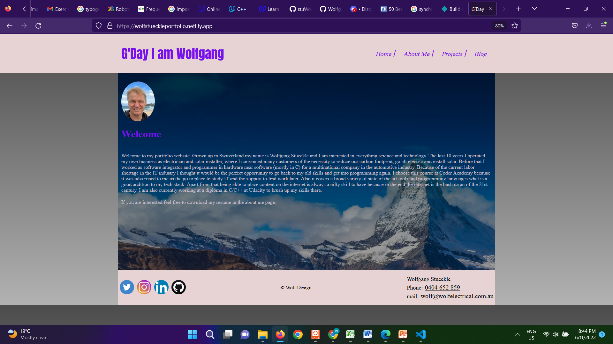

## Portfolio Website to present me as IT professional

## Installation

 git clone git@github.com:stuWolf/WolfgangStueckleT1A2.git

cd WolfgangStueckleT1A2

## Website Idea

[Wolf Electrical](https://www.wolfelectrical.com.au)

[Dribble] (www.dribbble.com)

## Logo maker

[Resource for logo maker](https://www.freelogodesign.org/)

## Images

[From Pixabay](https://pixabay.com/)
[From bing](https://bing.com/)

## Website link

[Wolfgang Stueckle portfolio](https://wolfstueckleportfolio.netlify.app/)

## Screenshot

## Tech stack

-HTML

-CSS

-Wireframes

-git

-Markdown

## Components used
-Button

-footer

-header

-pictures

## Sitemap and wireframes

## Target Audience

Headhunters and potential employers