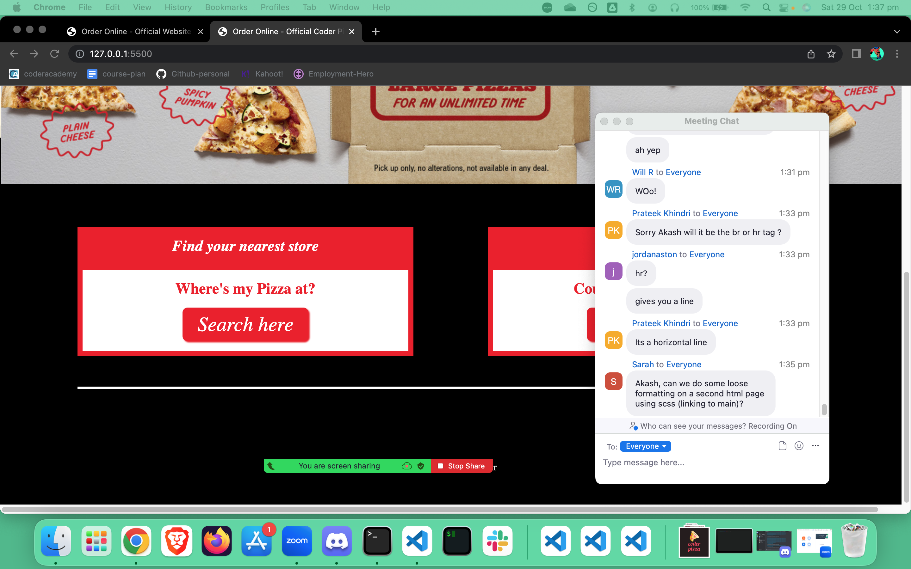

## Portfolio Website to present me as IT professional


## Installation

git clone git@github.com:wst/WolfgangStueckle.git

cd WolfgangStueckle

## Website Idea

[Wolf Electrical](https://www.wolfelectrical.com.au)

[Dribble] (www.dribbble.com)

```
git clone git@github.com:achhetr/coder-pizza.git
cd coder-pizza
```

## Logo maker

[Resource for logo maker](https://www.freelogodesign.org/)

## Images

[From Pixabay](https://pixabay.com/)

## Website link

[Wolf Electrical](https://www.wolfelectrical.com.au)

## Screenshot


## Tech stack

-HTML

-CSS

-Wireframes

-git

-Markdown

## Sitemap and wireframes




## Target Audience

Headhunters and potential employers